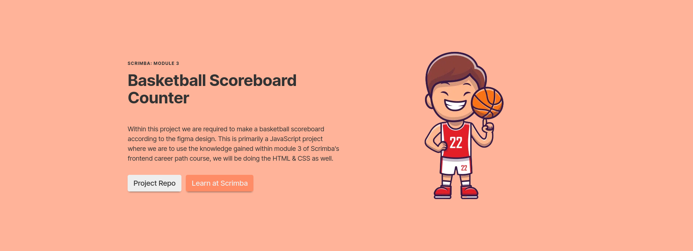
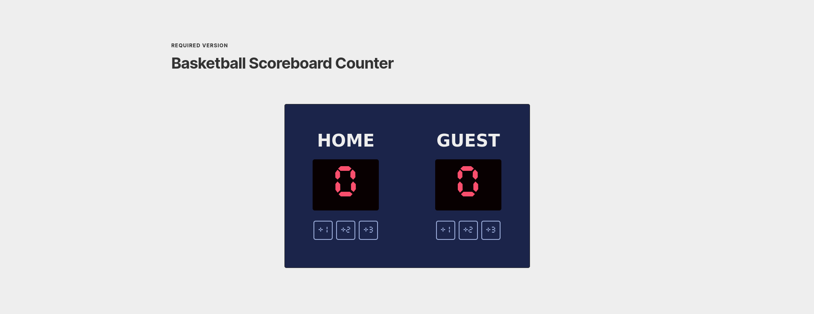
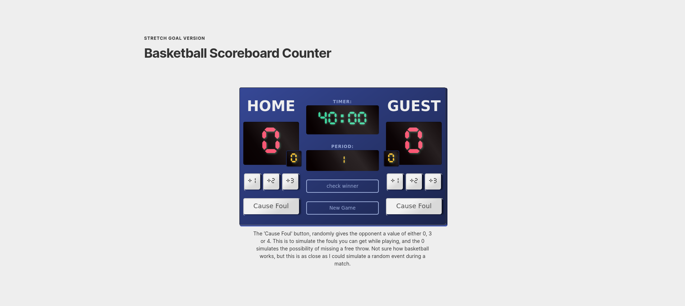

#### [SCRIMBA](https://scrimba.com "Scrimba's website") | MODULE 3 | BASKETBALL SCOREBOARD

This is a solo project by [Scrimba's Frontend Career Path](https://scrimba.com/learn/frontend "Scrimba's frontend career path web page") for pro members

#### [VIEW LIVE VERSION]()


<br>

#### ABOUT
_What is the project all about?_

Within this project we are required to make a basketball scoreboard according to the figma design. This is primarily a JavaScript project where we are to use the knowledge gained within module 3 of Scrimba's frontend career path course, we will be doing the HTML & CSS as well.  
We were given a figma [file](https://www.figma.com/file/YC48MCx4frBFtYoz6rNJE6/Basketball-Scoreboard?node-id=0-1&t=xW8c0fCB66AlnIDW-0) from which to design off of and given requirements & stretch goals to can complete the project, list can be seen [here](#project-goals--stretch-goals).

<br>

#### PROJECT SCREENS
_Some screenshots of the projects_


_This is the hero section of the page_

<br>


_The required version of the project_

<br>


_The stretch goal version of the project_

<br>

#### REQUIREMENTS
_What is required to run this project_

* Knowledge on HTML, CSS & JavaScript.
* Editor | _recommendation: [Visual Studio Code](https://code.visualstudio.com/ "Visual Studio Code Website")_
* A turtle, palm tree and coconuts.

<br>

#### FILES & DIRECTORIES
_Repository tree/blobs_

* [resources/](./resources/)
    * [css/](./resources/css/)
        * [styles.css](./resources/css/styles.css)
    * [images/](./resources/images/)
      * [readme/](./resources/images/readme/)
    * [javascript/](./resources/javascript/)
        * [app.js](./resources/javascript/app.js)
* [index.html](./index.html)
* [README.md](./README.md)

<br>

#### PROJECT GOALS & STRETCH GOALS
_Project instructions & challenges_

* Build it from Scratch 
* Follow the design
* Make all six buttons work

##### STRETCH GOALS

* Add a "New Game" button
* Highlight the leader
* Add a few more counters:
  * Period
  * Fouls
  * Timer
* Change the design
  * _If you want, change the counter to a different topic_

<br>

#### DESIGN NOTES
_Figma file, Colours, Fonts ..._

* Figma file [here](https://www.figma.com/file/YC48MCx4frBFtYoz6rNJE6/Basketball-Scoreboard?node-id=0-1&t=xW8c0fCB66AlnIDW-0)
* Font used
  * [Cursed Timer ULiL Font](https://www.fontspace.com/cursed-timer-ulil-font-f29411)
  * ```html
      <link rel="preconnect" href="https://fonts.googleapis.com">
      <link rel="preconnect" href="https://fonts.gstatic.com" crossorigin>
      <link href="https://fonts.googleapis.com/css2?family=Inter:wght@400;500;700&display=swap" rel="stylesheet">
    ```

  * ```css
     /* project typeface */
     --typeface-sans: 'Inter', sans-serif;
     /* figma project typeface */
     --project-typeface-lcd: 'Cursed Space', sans-serif;
     font-family: Verdana, sans-serif;
    ```
* Color palette
  * ```css
      /* project color palettes */
      --clr-main-shade: ;
      --clr-main: #eee;
      --clr-main-tint: ;
      --clr-grey: hsl(0, 0%, 20%);
      --clr-accent-shade: hsl(15, 100%, 70%);
      --clr-accent: hsl(15, 100%, 80%);
      --clr-accent-tint: hsl(15, 100%, 90%) 
      /* figma project color palette */
      --project-clr-main-shade: ;
      --project-clr-main: #1B244A;
      --project-clr-main-tint: ;
      --project-clr-grey: #EEE;
      --project-clr-border: #9AABD8;
      --project-clr-accent-shade: ;
      --project-clr-accent: #F94F6D;
      --project-clr-accent-tint: ;
    ```       

<br>

#### SOURCES
_Sources used within this project_

* For the images, credit goes to catalyststuff
  * [Images by catalyststuff on Freepik](https://www.freepik.com/free-vector/boy-playing-basketball-cartoon-people-sport-icon-concept-isolated-flat-cartoon-style_10920751.htm#query=basketball&position=0&from_view=author)

<br>

#### CREDITS
_Those who contributed to the project_

* [Andre W. Coetzer](https://github.com/awcoetzer)